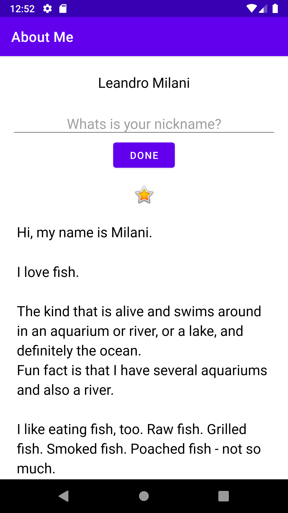
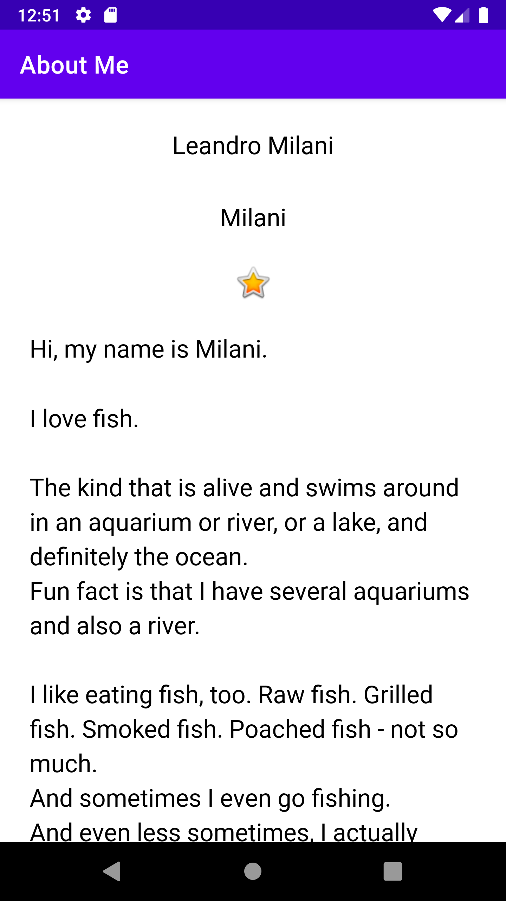

# About Me
This is the app for lesson 2 of the Udacity's Nanodegree - Android Kotlin Developer.

# Main topics
- View Groups & View Hierarchy
- Styling a View
- Data Binding: Views
- Data Binding: Data

# Screenshots

 
