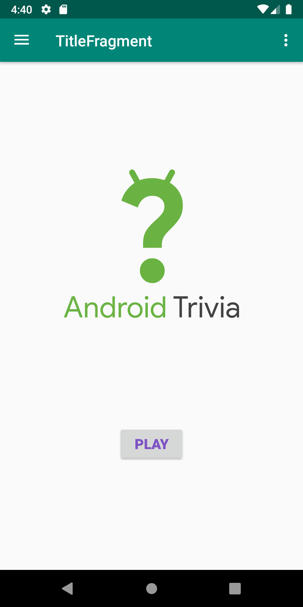
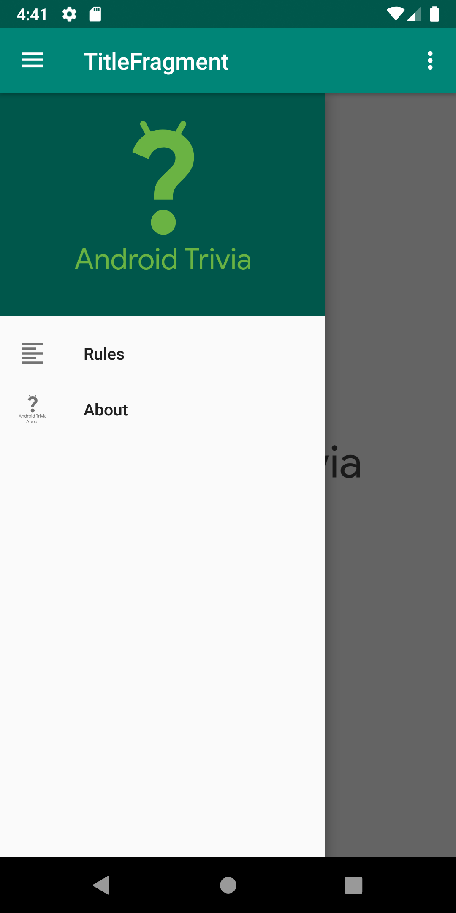
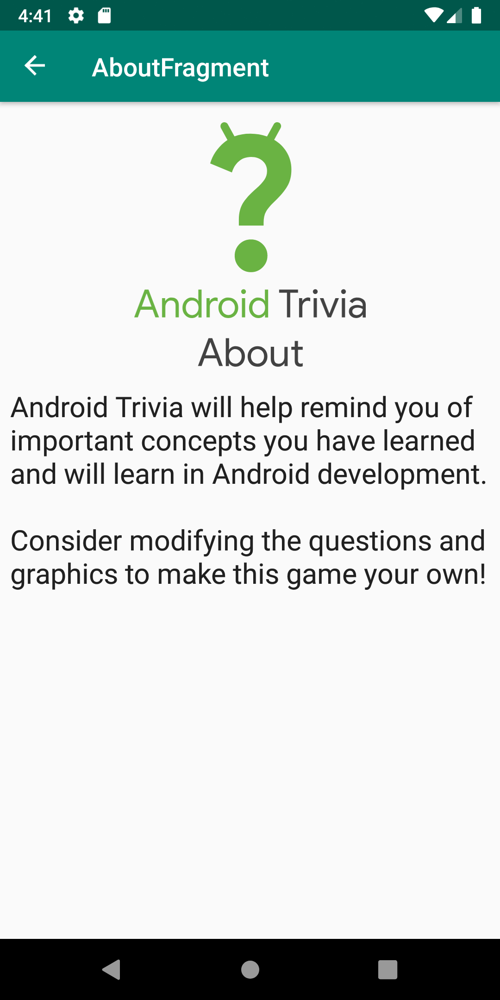
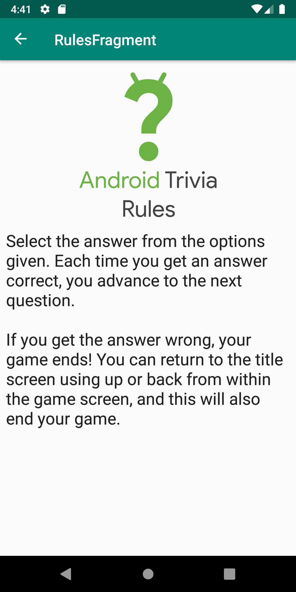
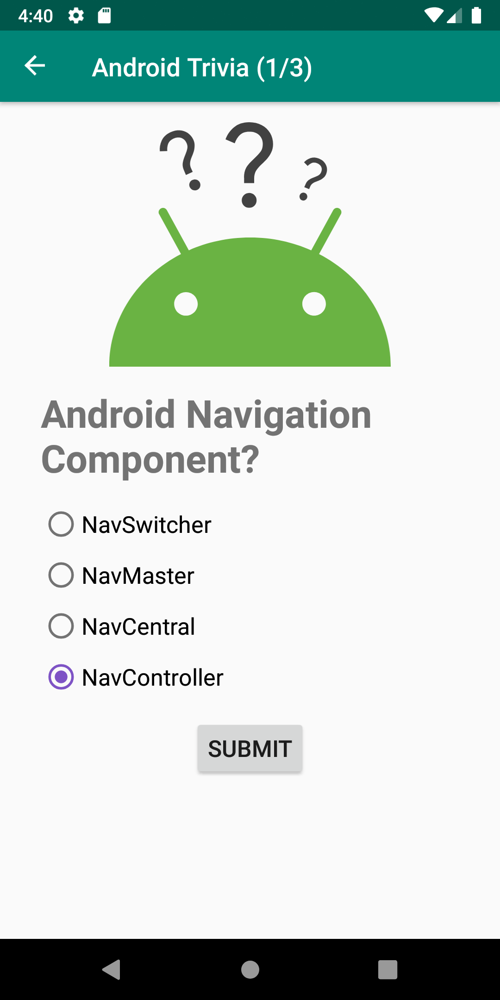
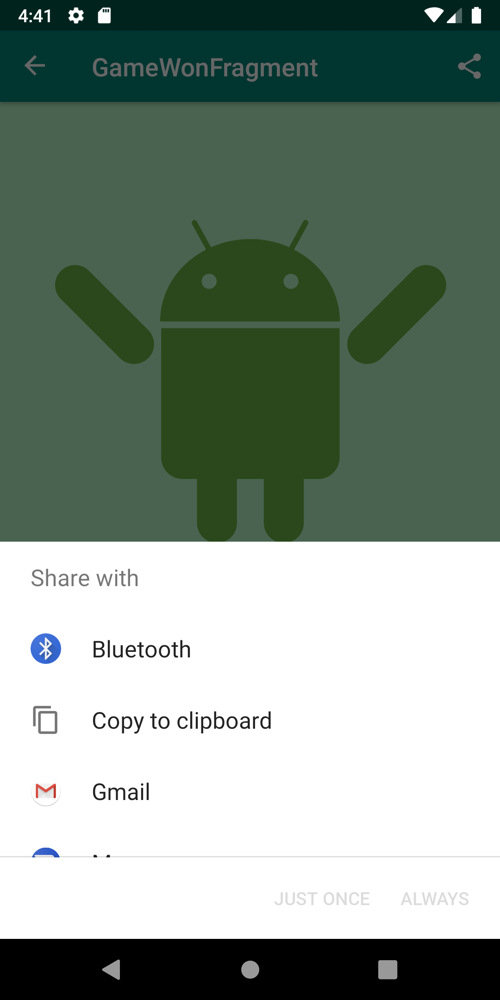

# Android Trivia
This app is part of lesson 3 from Udacity's Nanodegree - Android Kotlin Developer.

# Main topics
- Navigation
- Navigation Drawer
- Overflow menu
- Sharing with intent
- Animation with navigation

# Screenshots

 
 
 
 
