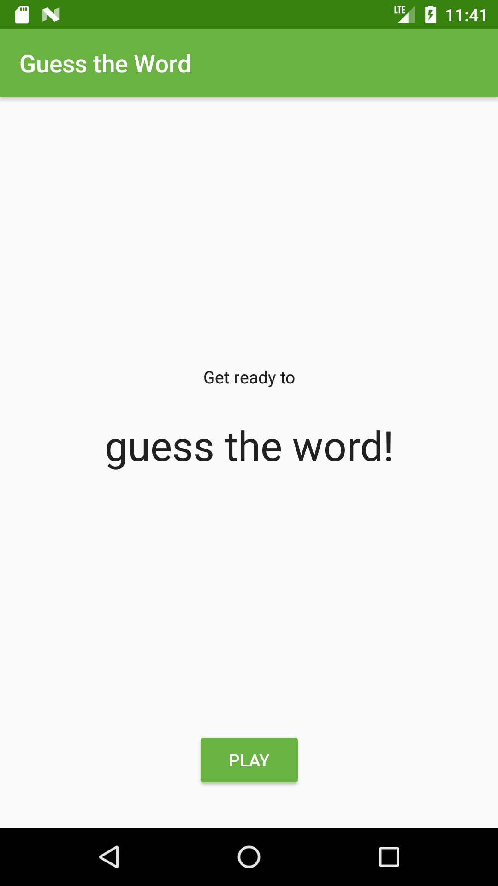
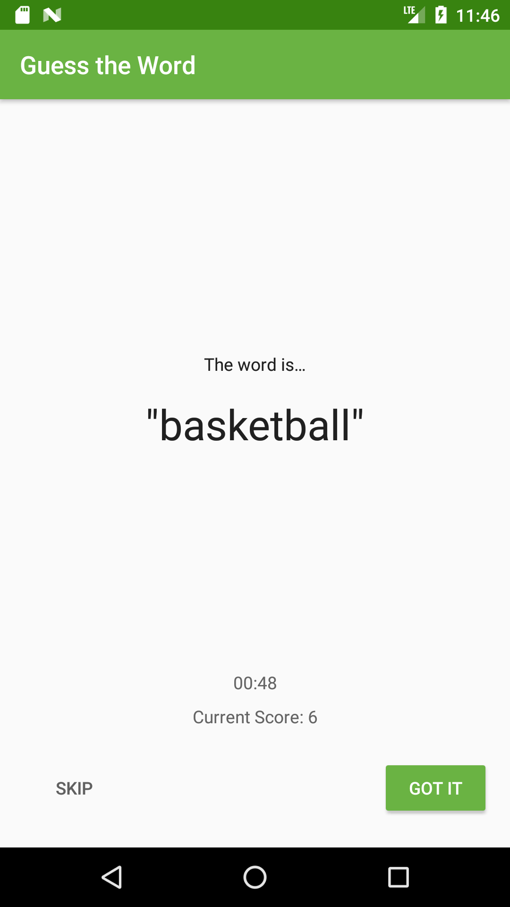
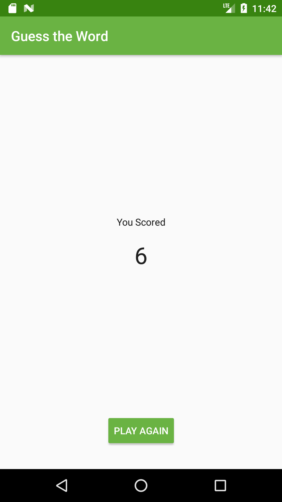

# Guess It
This app is part of lesson 5 from Udacity's Nanodegree - Android Kotlin Developer.

# Main topics
- Architecture
- ViewModel
- ViewModelFactory
- LiveData
- ViewModel to Data Binding
- LiveData Data Binding
- LiveData Map Transformation

# Screenshots

 
