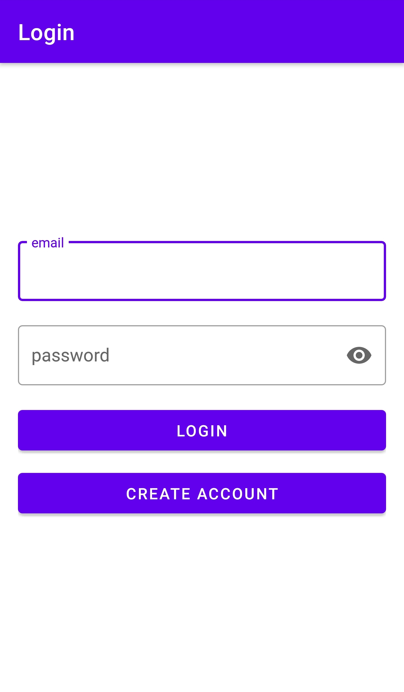
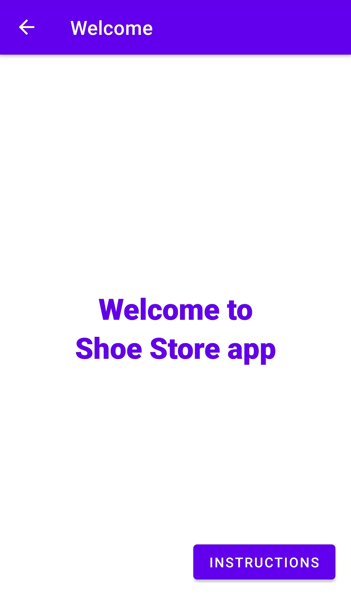
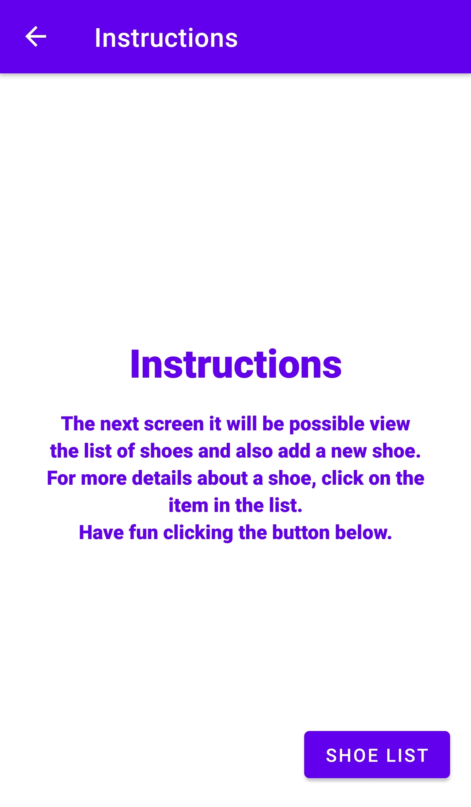
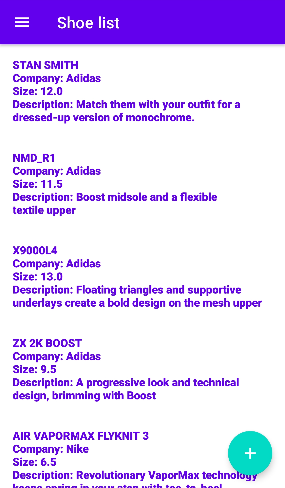
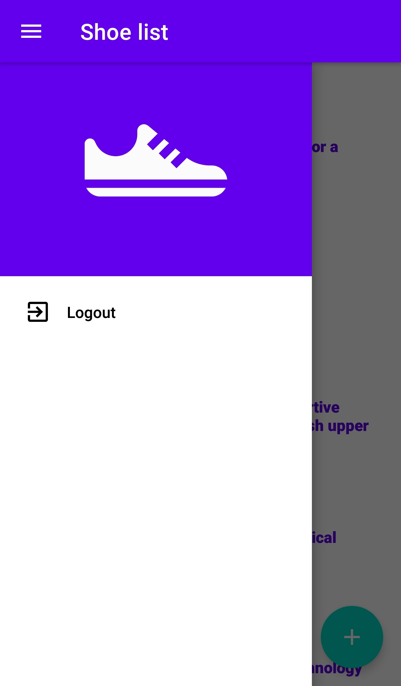
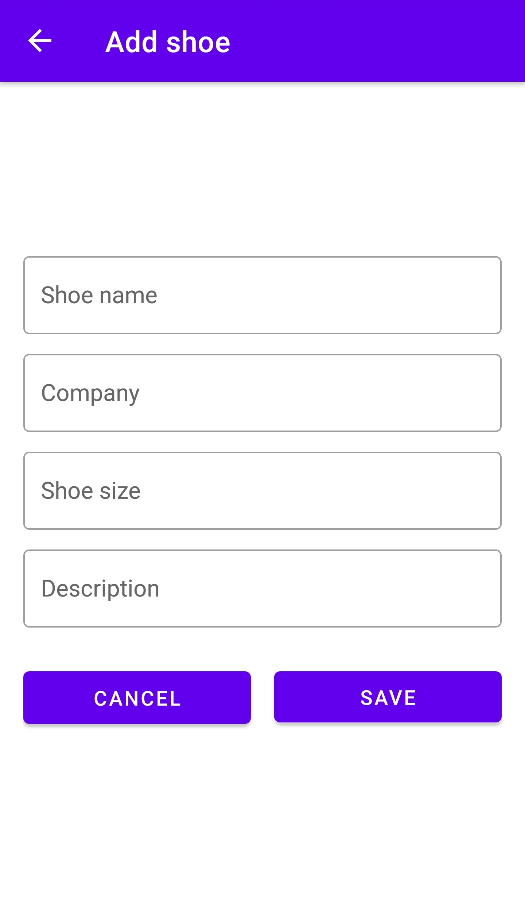
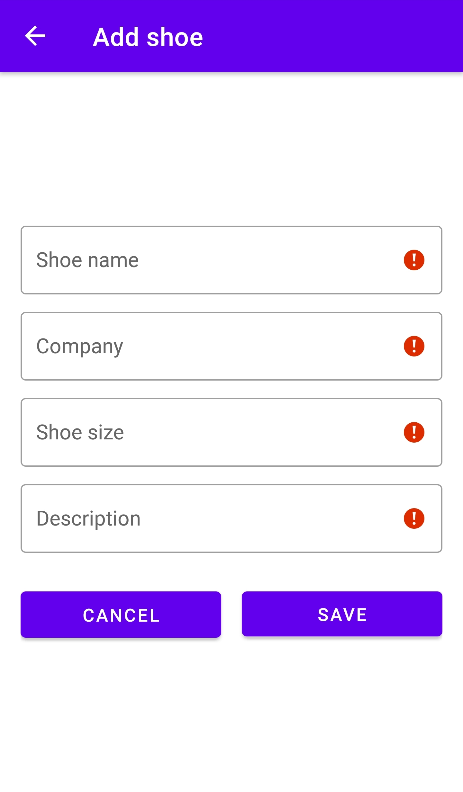

# Shoe Store Inventory
Project 1 from Udacity's Nanodegree - Android Kotlin Developer.

This project consist of five screens:

- Login screen
- Welcome onboarding screen
- Instructions onboarding screen
- Shoe Listing screen
- Shoe Detail screen for adding a new shoe

For this project there is a restriction, not to use ListView or RecyclerView. Therefore, the list items are added dynamically, via programming.

# Main topics
- Architecture Components
- ViewModel
- LiveData
- Navigation
- Two-way Data Binding
- Material Design

# Screenshots

<kbd></kbd> <kbd></kbd> <kbd></kbd> 
<kbd></kbd> <kbd></kbd> <kbd></kbd>
<kbd></kbd>
